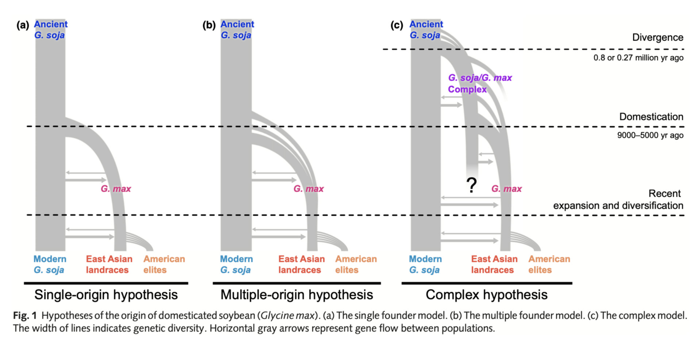

make .md Make into .docx
pandoc -o output.docx -f markdown -t docx textfile.md
make .docx to .md?
pandoc -o output.docx -f markdown -t docx textfile.md

Part One "Introduce the scope of the project with relevant review"
======

reference like this: [@carter04]
over all goals:

• deal with an important subject, covering just the scope relevant to the data analysis article. 

• add a perspective to the entire subject and contribute significantly to understanding.

SBPA = Swedish Breeding Program Accessions
SBP = Swedish Breeding Program
CCA = Core Collection Accessions. 
NWE = Northwest Europe
## is a heading
**this is a sub-heading** 
*this is a note to self what the heading/sub-heading or paragraph is about*

## 1. Introduction [X] draft1

- *Presents the topic/problem*

- *Presents, motivates and delimits the professional topic/problem precisely and clearly using relevant professional terminology and with reference to existing literature.*

- *Describes how the task is structured and what the purpose of the individual sub-elements is. The sub-elements are put in relation to each other and the assignment appears as a coherent text with an overall purpose.*

- *serves to set up your topic, purpose, and relevance. It tells the reader what to expect in the rest of your dissertation.*

overall goals writting differently:

- Establish the research topic, giving the background information needed to contextualize your work

- Narrow down the focus and define the scope of your research

- Discuss the state of existing research on the topic, showing the relevance to a broader problem or debate

- Clearly state your research questions and objectives

- Outline the flow of the rest of your work

**introduction checklist**

[ ] overall introduction to the topic

[ ] why is the topic important

[ ] why is the topic timely

[ ] why is the topic worth reflecting on

[ ] introduce the specific goal of reviewing what we know about the Swedish breeding program accessions

[ ] lead into the main section

*150-200 words* 220

**Text**
*purpose* draft 2

It is the purpose of this review to present the relevant knowledge and research about Soybean in northwest Europe as well as to motivate de novo expansion of the cultivation range of Soybean to north-western Europe. And to review that which is relevant to the expansion of the cultivation range and to collect the historical and now relevant soybean endeavours that have hitherto been stored in the historical literature and the NordGen seedbanks. 

*Important low diversity* draft 2

According to [@gizlice96] (and pedigree records (ref)) only 19 landraces are thought to have contributed as much as 85% of the genes to the North American breeding pools retaining 72% of genome diversity and being furthermore imposed by selective breeding, 79% of rare alleles were lost [@hyten06].  
Adaptation of crops to expand cultivation ranges.
This reduced level of genetic variation in elite breeding populations means that in the case of soybean, there is a need to look elsewhere to increase germplasm utilization for abiotic adaptation. Relevant accessions to have the potential for abiotic adaptation to cold tolerance for a rapidly changing climate have identified [@haupt20].

*the answer?* draft 2

But also, recently, awareness has grown around accessions in the NordGen gene bank that are the intermediary and results from a Swedish breeding program in the 40-the 70s using a mixture of elite cultivars and Japanese landraces. It could be very interesting to know more about these accessions, their diversity and what more? their relation to the rest of the germplasm. if there is a bottleneck already? rare alleles in comparison to american lost rare alleles? rather than looking at specific signatures of selection. hmm or is this the next things i would look at given the time. 

*timely* draft 2

The demand of soybean production only increases and has even more than doubled since the year 2000 to 2020 [@fao23]. An example of this is the report from the Sustainable Development Goals (SDG) goals where it is stated that x much more soy for human protein consumption will be needed to reach the SDG goal number 2 of Zero Hunger.
*Glycine max* is the domesticated species of *Glycine soya* that originated in China and was domesticated to *Glycine max* around 6000–9000 years ago [@carter04],[@kim2012b]. at this and that latitude.

*why soybean is relevant: because it's an important crop* draft 2

It is successfully grown (where) latitudes. in north and south america for feed and is imported to europe in great amounts (4/5ths?)(ref) for animal feed. Soy is the perfect feed crop because of its protein and oil content. More than three quarters of that produced is fed to animals. It is also gaining popularity as a means to enough protein in a vegetarian diet (20% of produced amount).

*there are downsides of the status quo*

There are things to consider when it comes to growing Europe's animal feed on the other side of the earth. Transport. Deforestation. (1/5th of deforestation is due to cropland expansion by crops like soy and oil palm (ref)). Food security  (there is a more recent interest in sourcing (society's fundamentals *other words* closer to home.) autonomy, both in europe and where the soy is grown. The animal waste that doesn't connect to the land use in the area. too much animal waste and not enough land to put it on. that would be different if there was less import.?
On top of the interest in the breeding of higher protein rich crops here in europe, as can be seen with the re-emergent interest in other nitrogen fixing crops such as Faba Bean (Vicia faba) or other legumes, growing soybean in NWE North Western Europe could be a logical addition to the crop rotation.

*The idea to develop soybean as a crop in northwest europe* draft 1

The idea is that it could be a good idea to research the possibility of developing elite cultivars that would grow well in Northwestern Europe.
Review what we know and to investigate and research accessions that we already know of (Swedish) and compare (CCA+GRIN).

*what to review:* draft 1

Soy domestication and the Detection of selection signatures in genes of interest relevant to the crop in general and abiotic adaptation.
The state of soybean agronomy and what are the climate change considerations for the future.
Population genetics can show relations and genetic diversity underlining the need for new genetic resources in the breeding pool.
abiotic adaptations needed and climate change considerations. The traits we know have an importance in northern europe.

we should grow soybean in NWE
Because
2. The composition of high protein and high oil is advantageous and is also the reason why so and so much is imported to the Nordic countries (Denmark, Sweden, Norway) each year.
3. Climate change
1. Soybean would be good in crop rotation as a legume
4. food security
[]

*composition*

*climate change*

Soybean is a unique crop because, as other legumes it has high protein content, but uniquely from other domesticated protein rich crops, there doesn't follow along a lot of carbohydrates in the seed. This makes soybean a fitting protein source. Furthermore, the protein content (aprrox X%) and quality @messina22 make it the most prevalent and cheap source of protein [@messina22],[@fang22]. 

*why good idea food security*

less international dependency: It seems that the future europe, for socioeconomic and environmental purposes will be more self sufficient when it comes to resources including plant proteins and fats sourcing. We import soy and other crops mainly as feed to our animals that then go on to be a source of meat protein for human consumption.

*why good idea food security*

"The production of meat has significantly larger environmental and climate footprints than the production of plant-based foods""Meat produces more emissions per unit of energy compared with that of plant-based foods because energy is lost at each trophic level." 
we should be able to source (grow) our plant based protein more locally. We import so much soy into europe  x ref.
Soybean is a great source of vegetarian soybean for direct or processed human consumption. According to [@messina22], soy-based meat substitutes compare well with their animal-based counterparts "because of the large acreage devoted to growing soybeans, this legume has the greatest potential for meeting the caloric and protein needs of a growing global population." Aditionally, soybean is already a refrence for 
Soy is also a vital ingredient (soy lecithin) in many processed foods. (numbers, ref)
The instability of our energy resources since war in Europe also has rekindled this idea of being self sustainable in Europe as an important political agenda.

## Main text body: [] draft1

*Description, explanation and discussion of results from the literature that are important in relation to the task's problem. It is typically divided into several paragraphs, where each paragraph deals with one sub-topic or one point of view, but where the connection is clear. The text must constitute an overall argument or lead to an overarching point that relates to the formulation of the problem.*

Introduce Glycine max from the several perspectives, the botanic, agronomic and domestication history and recent history in the north.

## Soy botany & Soy biotic and abiotic adaptations or difficulties in relation to growing in higher latitudes. & Climate change and soy 500-700 [] draft1   

*transition paragraph?*

   Kingdom: Plantae
   Phylum: Magnoliophyta
   Class: Magnoliopsida
   Order: Fabales
   Family: Fabaceae
   Subfamily: Faboideae
   Genus: Glycine
   Species: G. max
   Botanical name: Glycine max (L. Merr.)
   Common name: Soybean, Soya bean

*general introduction to soybean in a botanic sense*

*Glycine max* is a short day plant of the family *Fabaceae* also known as a Legume, it is one of the plant families that has a symbiosis with bacteria in nodes in the roots which fixate Nitrogen.

*traits where soy is or is not adapted to or relevant to NWE climate + the change in climate as ex seen in the CCA paper*
for a rapidly changing climate, or de novo adaptation of crops to expand cultivation ranges.
selection of suitable germplasm with phenotypic data
to increase germplasm utilization [@haupt20]

## Soy agronomy  300[] draft1

*transition?*

*Is there a need for more detail on how big soy is in the world?*

Soybean is the main source of plant protein and oil in the world, worldwide production in 2020 was 353.46 million tons. In The European Union in the same year 2.69 million tons were produced, and only 2560 tonnes in Northern Europe [@fao23]. One fifth 
of the soybean produced is used for human consumption. The oil is the main source for cooking oil in the world and the      [@fang22]

*important crop due to all the uses. food feed, the production of biofuels, bioplastics, and other industrial products.*
protein quality [@gorissen18]

*crop rotation and nitrogen fixation*

**

*are there similar places (where soy is grown? canada japan.. why not just adapt their cultivars? how are they different*

**

## Soy domestication 500 [] draft1

*transition?*

*time and place*

wild soybean grows commonly in eastern China (from 24--53°N lat.), Japan, Korea, and the eastern extremes of Russia [@carter04]

Traces of soybean in the literature have been found in The Chou Dynasty (1122–221 BC) of China. And as the Dynasty expanded with trade, soybeans migrated with people to South China, Korea, Japan and SouthEast Asia [@hymowitz1970]. However, for soybean to already be a trade commodity at that point the domestication process must have taken place well before. Modern cultivated soybean *Glycine max* is estimated to have been domesticated from wild soybean (*Glycine soja* Sieb. & Zucc.) in East Asia 6000–9000 yr ago [@carter04],[@kim2012b].

*Origin hypotheses*

There are three main hypotheses as to the origin of soybean as it is known today. 

origin hypothesis  fig ref [@sedivy17]

- Single origin (ref) 
that *Glycine soy* is the 

- multiple origin

- Complex origin [@lee11], [@kim2012b]

*frameshifts, snps, indels, cnvs, LD fst*

*glycine soy?*
read paper The Untapped Genetic Reservoir: The Past, Current, and Future Applications of the Wild Soybean (Glycine soja) [@kofsky18] 

## Soybean pop gen 500 [] draft1

*transition?*

*genetic architecture of soybeans*

see pan genome paper

*genetic bottlenecks*

Several severe genetic bottlenecks occurred during soybean domestication. During domestication to the landraces the sequence diversity in comparison to the wild species was halved, with 81% of rare alleles lost [@hyten06] and two major bottlenecks when very few landraces were used in the development of the north american modern cultivars and then on to the breeding of the past 75 years in america to the elite cultivars there is now.

*diversity*

*selection or deleterious mutations removed and diversification occurred*

**genes** *underlying domestication-related traits /improvements /diversification* 
photoperiodic flowering
flower, seed coat and pod colour

see [@sedivy17]

*Population structures*

inferred population histories and demographies

## Soy gene banks 500 [] draft1

*transition?*

*Extremely short history of gene / seed banks and their paramount importance!*

"The largest collection for G. max is maintained at the Institute of Crop Germplasm Resources in China which has over 23,000 accessions while the second largest collection is maintained at the USDA Soybean Germplasm collection in Urbana, IL, USA which contains over 18,000 accessions (Carter et al., 2004)." from book : https://www.sciencedirect.com/science/article/pii/B9780983079101500078

*GRIN USDA Soybean Germplasm collection*

*NORDGEN genebank*

## Soy history in NWE (SBP) + CCA 700-900 [] draft1

*transition*

*SBP origin*
SBP 1938-1973
(from my pp)
There are primarily three characteristics that distinguish the soybean varieties from Holmberg’s breeding and that are entirely essential to the adaptation to the Swedish climate: (1) Adaptation to long-day-climate. (2) Tolerance against low summer temperatures. (3) Early ripening. Three varieties of soybeans from Sven Holmberg’s breeding are or have been incorporated into the Swedish list of varieties, Fiskeby V, Bråvalla and Träff.
Fiskeby highest yielding
Bråvalla and Träff are short and extremely early varieties. They ripen 8 and 12 days, respectively, earlier than Fiskeby V.
The soybean varieties from Fiskeby are well known among soybean growers all over the world, consisting of a source for early gestation and tolerance against low temperatures in breeding programs, wherever these characteristics were needed. 

In sweden 

CCA
(pp)
Environmental data characterizing the geographic origin of germplasm in combination with environmental conditions of the Target Population of Environments.
genes that are known or hypothesized to be involved in abiotic adaptation. [@haupt20]

## Conclusion and perspective (questions & posibilities) 350-500 words [] draft1

*The points from each subtopic are gathered into an overarching argument, an assessment or a conclusion that answers the problem set out in the introduction. Here, the author may identify shortcomings in the literature/science or provide perspective in another way.*

*What is the problem/Question?*

There are 136 soybeans in the NORDGEN gene bank and we want to know if they could be of use.

*Why is it important again?*

It is important because it would be a good idea to be able to grow more protein and oil rich crops in Northern Europe.

*What do we not know?*

We don't know really know what we have.
We don't know how these NORDGEN accessions relate genetically to the rest of the soy.
We don't know whether there is genetic potential or a good starting point for future breeding programs here.

*bit that we do know*

we know that there is the cultivar Fiskeby and a few other accessions which are thought to have potential
we know there was a breeding program
we know some of the founders
We know that Fiskeby has been used in breeding for canadian cultivars successfully and that field trials in denmark showed potential. 

*but... (smaller knowledge gap and transition to next paragraph)*

but we want to show that the founders were indeed the founders
and that the Swedish accessions are a genetic unit.

*bit that we do know:*

but we do know there was a breeding program with resulting cultivars.

*but... (smaller knowledge gap and transition to next paragraph)*

but we would like to know if the selection of founders and succeeding breeding program if they did select for traits or if it was just drift?

*bit that we do know:*

We know there are areas of interest in the soybean genome. Flowering and cold tolerance.
but... (smaller knowledge gap and transition to next paragraph)
We would like to look for signals of selection there.
We also know of the CCA and would like to see how they relate to the SBPA

When these questions are answered we can better know how to proceed for optimal breeding for soybean in NWE.

*conclude that the diversity is low*

*that the CCA is a start*

the core collection is still too many accessions to start a breeding program. also its too few parameters. only weather and in comparison to origin.  

*and nordgen accessions could have potential*

## Bibliography: [] draft1

*Indicates the literature referred to in the text. A prerequisite for being able to write a good literature review is a thorough orientation in the literature, so that you can define a relevant and important problem, write a good problem formulation and then select the scientific studies that are most important for the subject.*

! how to reference this website in a way they want via zotero? [@fao23] “FAO. Crops and livestock products. License: CC BY-NC-SA 3.0 IGO. Extracted from: https://www.fao.org/faostat/en/#data/QCL. Date of Access: 06-02-2023.” 

